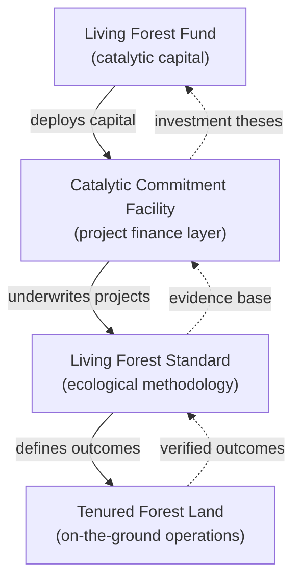

# P1 — Diagrams to structured representation

The playbook that came directly out of the Kwaxala session. For any flowchart, process diagram, system diagram, or layered stack visual, produce **three things**:

1. The image (embedded reference)
2. A prose description (2–4 sentences, covers what the diagram shows and why it matters)
3. A structured representation (mermaid, table, or indented bullet tree — whichever fits)

The point: an LLM reading the resulting markdown shouldn't need to re-OCR the image to understand the diagram's content. The structured form carries the semantics.

## When to use

Apply P1 when the source contains:

- **Flowcharts** (process flows, decision trees, workflows)
- **System diagrams** (components and their relationships, architecture, data flow)
- **Layered stacks** (tech stacks, concept stacks, nested hierarchies)
- **State diagrams** (states and transitions)
- **Comparison diagrams that aren't pure tables** (before/after with arrows, transformation visuals)
- **Timelines with structure** (phases, milestones, dependencies)
- **Network/relationship graphs** (nodes connected in meaningful ways)

## When NOT to use

Skip structured representation for visuals that are fundamentally pictorial:

- **Photographs** (landscapes, portraits, scenes) — use P4 description only
- **Illustrations and artwork** — description only
- **Maps** (unless they're schematic/stylised) — description only; maps are best referenced as images
- **Charts and data visualisations** (bar, line, pie, scatter) — description + the underlying data extracted as a table if possible, but not mermaid
- **Icons and decorative graphics** — skip entirely or minimal alt text

If in doubt: can you meaningfully represent this in text-based structure? If yes, do it. If no (the visual IS the information), image + description is enough.

## Choosing the structured format

Different diagram types map best to different representations:

| Diagram type | Best structured form | Mermaid syntax |
|---|---|---|
| Linear process (A → B → C) | Mermaid flowchart | `flowchart LR` |
| Branching flowchart / decision tree | Mermaid flowchart | `flowchart TD` |
| System architecture (components + connections) | Mermaid graph | `graph TD` or `graph LR` |
| State machine | Mermaid state diagram | `stateDiagram-v2` |
| Class/concept hierarchy | Mermaid class diagram | `classDiagram` |
| Nested layered stack | Indented bullet tree OR nested code block | (not mermaid) |
| Sequence / interaction | Mermaid sequence diagram | `sequenceDiagram` |
| Entity relationship | Mermaid ER diagram | `erDiagram` |
| Comparison (before/after with transformation) | Two-column table + description | (not mermaid) |
| Timeline with phases | Mermaid timeline OR table | `timeline` or table |

**When mermaid fights the content:** use an indented bullet tree. Don't force mermaid on visuals that don't map cleanly — a fake-looking flowchart is worse than honest bullets.

Example fallback for a layered stack:

```
The Kwaxala stack (from top to bottom):
- **Living Forest Fund** — catalytic finance wrapper
  - pools capital from aligned investors
  - deploys into Catalytic Commitment Facility
- **Catalytic Commitment Facility** — project finance layer
  - underwrites individual TFL/LFS projects
  - uses Living Forest Standard as methodology
- **Living Forest Standard (LFS)** — ecological outcome methodology
  - defines what qualifies as a TFL
  - scorecarded against 4 pillars
- **Tenured Forest Land (TFL)** — on-the-ground operations
  - the forest being managed regeneratively
```

That's often more readable than a forced mermaid class diagram.

## Mermaid tips

- **Keep node labels short.** Long labels break layout. Abbreviate and expand in the prose description.
- **Use `flowchart` not `graph`** for new diagrams — `flowchart` is the newer, cleaner syntax.
- **Direction matters**: `TD` (top-down) for decisions and processes, `LR` (left-right) for linear flows.
- **Test syntax by eyeball**: mermaid errors silently when rendered. Read your output back before finalising.
- **Escape special chars** in labels with quotes: `A["Label with (parens)"]`.
- **For complex diagrams (>15 nodes)**, consider splitting into two simpler diagrams.

## Worked example (from Kwaxala, slide 9 — the four-step stack)

**Source visual:** A layered diagram showing four stacked layers: Tenured Forest Land at the bottom, Living Forest Standard above it, Catalytic Commitment Facility above that, and Living Forest Fund at the top. Arrows show money flowing down and ecological outcomes flowing up.

**Output:**

```markdown


**The four-layer Kwaxala architecture.** Finance flows down the stack from the Living Forest Fund (top) through a Catalytic Commitment Facility that underwrites individual projects, which are evaluated against the Living Forest Standard methodology, and ultimately land as regenerative management of Tenured Forest Land on the ground. Ecological and cultural outcomes flow back up: TFL generates verified outcomes, which feed the standard's evidence base, which validates the facility's investment theses, which builds investor confidence in the fund.


```

Notice the pattern: image reference, short prose description, mermaid. All three. An agent reading this markdown can understand the stack without opening the image.

## Failure modes

**Trying to force mermaid on non-diagrammatic visuals.** A photo of a forest with some overlaid text isn't a diagram. Don't mermaid it.

**Losing fidelity in translation.** If the source diagram has 20 interconnected nodes and you reduce it to 5 boxes, you've lost the point. Either capture the full structure or acknowledge the simplification in the prose ("The full diagram shows 20 components; key ones are represented below").

**Mermaid syntax errors.** Mermaid fails silently in most renderers. Common errors:
- Unescaped parentheses in labels
- Missing quotes around labels with spaces
- Wrong diagram type for the content
- Cyclical dependencies in flowcharts (valid but sometimes unintended)

Always read back your mermaid output and mentally render it to verify.

**Description redundancy.** Don't re-describe in prose what's obvious from the mermaid. Description explains *why it matters*; mermaid captures *what it is*. Two different jobs.

**Missing the forest for the nodes.** Sometimes the important thing about a diagram is the overall pattern, not the individual nodes. The prose description should lead with the pattern: "This is a closed-loop feedback system" or "This shows three independent flows converging." Then the structured form fills in the detail.

## Deviation guidance

This playbook's defaults are right for ~80% of diagrams. Deviate when:

- The diagram is so simple that structured form is overkill (one arrow between two boxes). Just use prose.
- The diagram is so complex that structured form would take hours to produce and not add value. Note the limitation in prose and move on.
- The document context makes the diagram's structure obvious from surrounding text (e.g. the prose already walks through the flow step by step). Don't duplicate it in mermaid.
- The structured form would be longer than the original diagram's information content. That's a sign you're over-engineering.

Name the deviation in your narration so it's visible: "Skipping mermaid for this diagram — it's a simple two-node flow and the caption already explains it."
